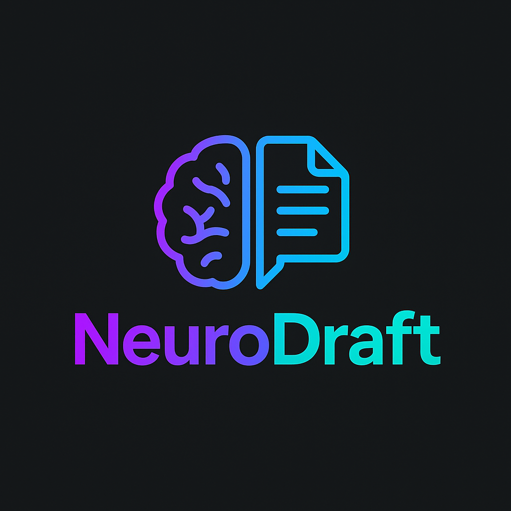

# NeuroDrafts Frontend

## 🚀 Overview

NeuroDrafts, yapay zeka destekli, klasör-temelli not alma ve dosya yönetimi sağlayan modern bir SaaS platformudur.  
Frontend uygulaması, React/Next.js, TypeScript ve Tailwind CSS kullanılarak geliştirilmiştir.

---

## 🌟 Özellikler

- ⚡️ Hızlı ve kullanıcı dostu arayüz
- 📂 Klasör ve dosya tabanlı organizasyon
- 📝 AI destekli not özetleme ve içerik analizleri
- 🔒 Güvenli authentication (JWT/Session)
- 📱 Responsive (mobil & masaüstü uyumlu)
- 🎨 Modern UI: Tailwind CSS, animasyonlar, ikonlar
